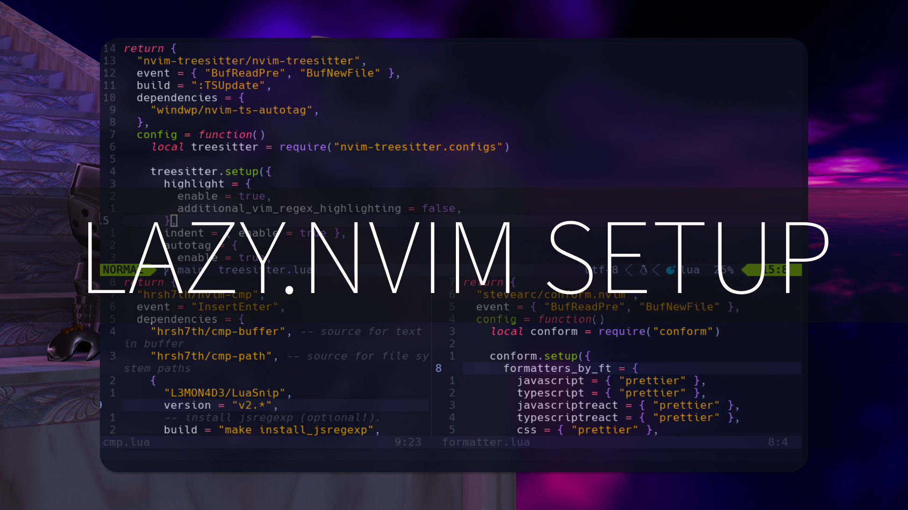

Neovim Setup made with Lua and lazy.nvim for fullstack development.

import Badge from '../../components/Badge.astro'

<Badge>website</Badge>[slydragonn/nvim-lazy](https://github.com/slydragonn/nvim-lazy)

<Badge>platform</Badge> Linux/Windows/Mac

<Badge>BlogPost</Badge>[dev.to](https://dev.to/slydragonn/ultimate-neovim-setup-guide-lazynvim-plugin-manager-23b7)

<Badge>Stack</Badge> Lua, Lazy.nvim

<Badge>Video</Badge> [My Ultimate Neovim Setup with Lazy.nvim for Linux and Windows](https://youtu.be/-kCUks3xrCM)

